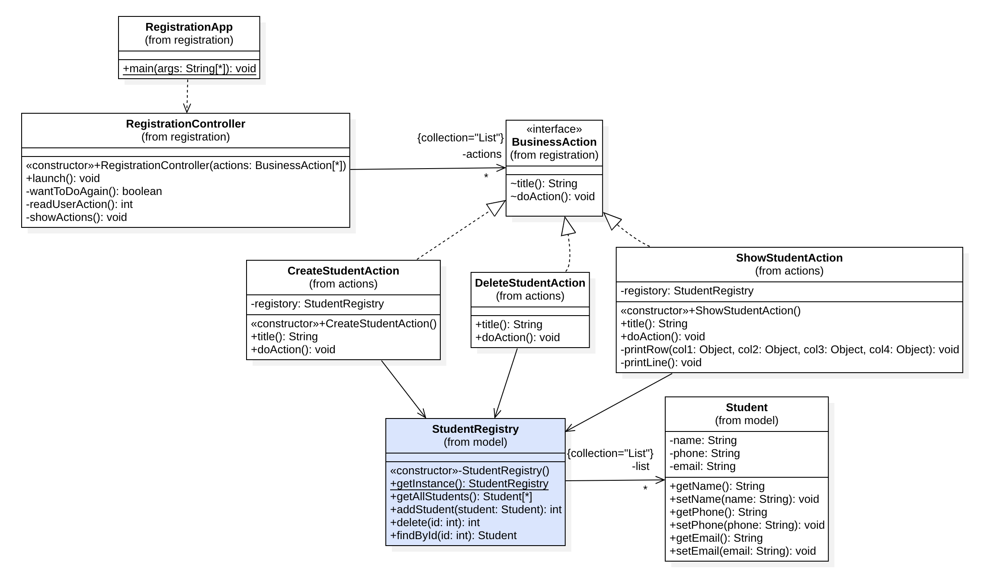

## Singleton Pattern

Object တွေကို တည်ဆောက်ပေးနိုင်တဲ့ Creational Pattern အမျိုးအစားဖြစ်ပြီး၊ တစ်ခုထည်းသော Object အဖြစ်ရေးသားအသုံးပြုလိုတဲ့အခါမှာ ရေးသားနိုင်ပါတယ်။



အထက်ပါနမူနာ Program ထဲမှာ StudentRegistry Class ဟာ Student Object တွေကို သိမ်းပေးထားဖို့အတွက် အသုံးပြုနေပါတယ်။ တဖန် CreateStudentAction, DeleteStudentAction, ShowStudentAction Business Object တွေမှာ StudentRegistry Object ကို အသုံးပြုပြီး Business Action တွေကို လုပ်ဆောင်စေပါတယ်။

အထက်ပါအနေအထားမျိုးမှာ Business Action တစ်ခုအတွက် StudentRegistry Object တစ်ခုကို သွားသုံးမိနေရင် Student Data တွေကို Business Action တွေအကြားမှာ Sinchronize လုပ်နိုင်မှာမဟုတ်တော့ပါဘူး။ StudentRegistry ကို တစ်ခုထဲသော Object ကို Create လုပ်နိုင်တဲ့ Class ဖြစ်အောင် တည်ဆောက်ထားဖို့လိုပါတယ်။


### Implementations

- Object ကို ဆောက်ချင်တိုင်းဆောက်လို့မရအောင် Constructor ကို Private အဖြစ်လုပ်ဆောင်ထားသင့်ပါတယ်
- တစ်ခုထဲသော Object ဖြစ်အောင် Private Static Field အနေနဲ့ သတ်မှတ်ရေးသားထားရပါမယ်
- အသုံးပြုလိုတဲ့အခါမှာ ရယူနိုင်ဖို့အတွက် Public Static Method တစ်ခုကို ရေးသားထားပြီး Private Static Field က Null ဖြစ်နေရင် Object ဆောက်ပြီး နောက်ဆုံးမှာ တစ်ခုထဲသော Object ကို Return ပြန်ပေးရပါမယ်

```
public class StudentRegistry {
	
	private List<Student> list;

	// 1 Make Private Constructor
	private StudentRegistry() {
		list = new ArrayList<>();
	}

	// 2 Make Online One Object
	private static StudentRegistry instance;

	// 3 Create Public Accessor and instantiate when need
	public static StudentRegistry getInstance() {
		if (null == instance) {
			instance = new StudentRegistry();
		}
		return instance;
	}

	// Business Method

}
```

