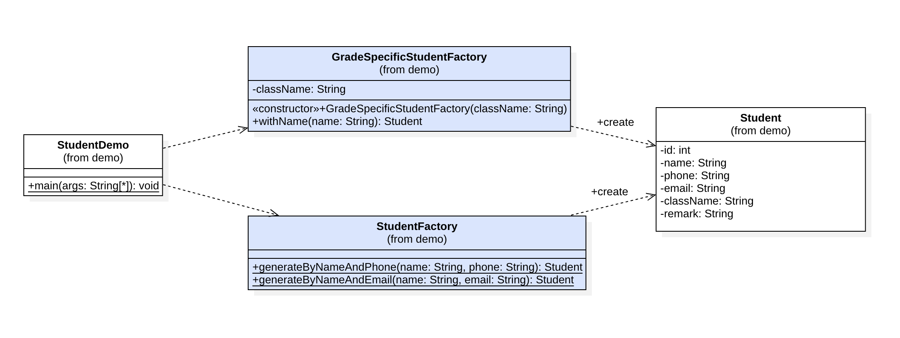

## Factory Method Pattern

Object တွေကို တည်ဆောက်ရာမှာ အသုံးပြုနိုင်တဲ့ creational pattern အမျိုးအစားဖြစ်ပါတယ်။ 

များသောအားဖြင့် Object တွေကို တည်ဆောက်တဲ့နေရာမှာ Constructor တွေကို အသုံးပြုလေ့ရှိကြပါတယ်။ Class တစ်ခုကနေ Object တစ်ခုကို ပုံစံအမျိုးမျိုးနဲ့ တည်ဆောက်လိုတဲ့အခါမျိုးတွေမှာ Constructor တွေကို Overload လုပ်ပြီးရေးသားလေ့ရှိကြပါတယ်။ Constructor တွေမှာ အခြေခံအားဖြင့် အားနဲချက် နှစ်ခုရှိပါတယ်။

- Constructor Name ဟာ Class Name နဲ့ တူအောင်ရေးရမှာ ဖြစ်လို့ Constructor Name ကိုကြည့်ပြီး Object တစ်ခုကို ဘယ်လိုတည်ဆောက်နေတာလဲ ဆိုတာကို နားလည်လွယ်အောင် ရေးသားလို့ မရနိုင်ဘူး
- Argument List တူတဲ့ Constructor တွေကို ရေးသားလို့မရနိုင်ဘူး



Factory Method ဆိုတာကတော့ Object တွေကို Return ပြန်ပေးနိုင်တဲ့ Method တွေပဲ ဖြစ်ပါတယ်။ Method ဖြစ်တဲ့အတွက် နားလည်လွယ်တဲ့ Method Name တွေကို ရေးသားပြီး ဘယ်လိုမျိုးတည်ဆောက်နေတာလဲ ဆိုတာကို နားလည်လွယ်အောင် ရေးသားဖေါ်ပြနိုင်ပါတယ်။ ထို့အပြင် Method Name မတူပဲ Argument List တူတဲ့ Method တွေကိုလဲ ရေးသားနိုင်မှာ ဖြစ်ပါတယ်။

### Implementations

- တည်ဆောက်လိုတဲ့ Method ကို Return Type အနေနဲ့ ရေးသားထားရပါမယ်
- Method Name ကို Object ကို ဘယ်လိုတည်ဆောက်တာလဲ ဆိုတာကို နားလည်တဲ့ နာမည် ပေးထားသင့်ပါတယ်
- လိုအပ်သလို Method Argument တွေကို ရယူနိုင်ပါတယ်
- Static Method ပဲဖြစ်ဖြစ် Instance Method ပဲဖြစ်ဖြစ် Factory Method အနေနဲ့ အသုံးပြုနိုင်ပါတယ်

#### Static Factory Methods

```
public class StudentFactory {

	public static Student generateByNameAndPhone(String name, String phone) {
		var student = new Student();
		student.setName(name);
		student.setPhone(phone);
		return student;
	}

	public static Student generateByNameAndEmail(String name, String email) {
		var student = new Student();
		student.setName(name);
		student.setEmail(email);
		return student;
	}
}
```

Factory ထဲမှာ သီးခြား State တွေကို ထားပြီး သုံးစရာမလိုဘူးဆိုရင် Static Method တွေကိုလဲ Factory Method အနေနဲ့ အသုံးပြုနိုင်ပါတယ်။

#### Instance Factory Methods

```
public class GradeSpecificStudentFactory {

	private String className;

	public GradeSpecificStudentFactory(String className) {
		this.className = className;
	}

	public Student withName(String name) {
		var student = new Student();
		student.setName(name);
		student.setClassName(className);
		return student;
	}
}
```

အထက်ပါနမူနာထဲကလို Factory တွေမှာ ကိုယ်ပိုင် State တွေကို ထားပြီး အသုံးပြုချင်တယ် ဆိုရင်တော့ Instance Factory Method တွေကို ရေးသားအသုံးပြုရမှာ ဖြစ်ပါတယ်။