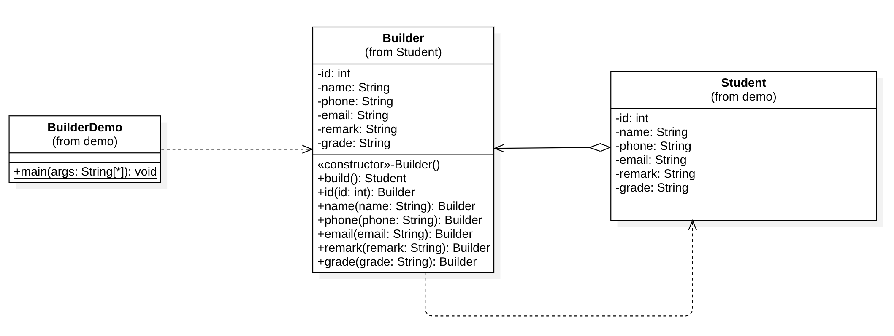

## Builder Pattern

Object တစ်ခုမှာ State များစွာပါဝင်ပြီး ပုံစံအမျိုးမျိုးနဲ့ Object ကို Create လုပ်လိုတဲ့အခါမျိုးတွေမှာ Factory Method ကို သာ အသုံးပြုရရင် Method တွေအများကြီး ရေးသားထားရတော့မှာ ဖြစ်ပါတယ်။ ထိုအခါမျိုးတွေမှာ Builder Pattern လေးကို ရွေးချယ် အသုံးပြုနိုင်မှာ ဖြစ်ပါတယ်။



### Implementations

- Builder Pattern ကို အသုံးပြုတော့မယ်ဆိုရင် Target Class ကနေ Constructor ကို အသုံးပြုပြီး Object မဆောက်နိုင်အောင် Constructor ကို Private လုပ်ထားတာကောင်းမယ် ထင်ပါတယ်
- Target Class ထဲမှာ Builder Class ကို Static Nested Class အနေနဲ့ ရေးသားထားပြီး build() Method ကနေ Target Object ကို တည်ဆောက်ပေးနိုင်အောင် ရေးသားထားဖို့လိုအပ်ပါတယ်
- Builder Class ထဲမှာ Target Class နဲ့ တူညီတဲ့ Fields တွေကို ရေးသားထားရန်လိုအပ်ပြီး build() လုပ်တဲ့အခါမှာ Builder ထဲက State တွေနဲ့ Target Object ကို တည်ဆောက်ပေးရပါမယ်
- Builder ရဲ့ State တွေကို ပြောင်းနိုင်တဲ့ Method တွေရဲ့ name ကို State Name နဲ့ တူအောင် ရေးထားတာ ဘယ်လို State ကို Set လုပ်နေတယ် ဆိုတာကို နားလည်ရလွယ်ကူစေပါတယ်


```
public class Student {

	private int id;
	private String name;
	private String phone;
	private String email;
	private String remark;
	private String grade;

	// Private Constructor for Target Class
	private Student(int id, String name, String phone, String email, String remark, String grade) {
		super();
		this.id = id;
		this.name = name;
		this.phone = phone;
		this.email = email;
		this.remark = remark;
		this.grade = grade;
	}

	public static Builder builder() {
		return new Builder();
	}

	public static class Builder {
		
		// Same Fields as Target Class
		private int id;
		private String name;
		private String phone;
		private String email;
		private String remark;
		private String grade;

		private Builder() {
		}

		// build method to create target object
		public Student build() {
			return new Student(id, name, phone, email, remark, grade);
		}

		public Builder id(int id) {
			this.id = id;
			return this;
		}

		public Builder name(String name) {
			this.name = name;
			return this;
		}

		public Builder phone(String phone) {
			this.phone = phone;
			return this;
		}

		public Builder email(String email) {
			this.email = email;
			return this;
		}

		public Builder remark(String remark) {
			this.remark = remark;
			return this;
		}

		public Builder grade(String grade) {
			this.grade = grade;
			return this;
		}
	}

	// Getter & Setters

}
```

- State တွေကို Set လုပ်နေတဲ့ Method တွေရဲ့ Return Value ကို Builder ကိုယ်တိုင်ကို သတ်မှတ်ထားခြင်းအားဖြင့် State Change Method တွေကို Chain တစ်ခုအနေနဲ့ ရေးသားသွားနိုင်မှာဖြစ်ပါတယ်

```
	public static void main(String[] args) {

		var student = Student.builder()
				.name("Aung Aung")
				.phone("091827272")
				.email("aung@gmail.com")
				.grade("Grade 10").build();
		
		System.out.println(student);
	}
```