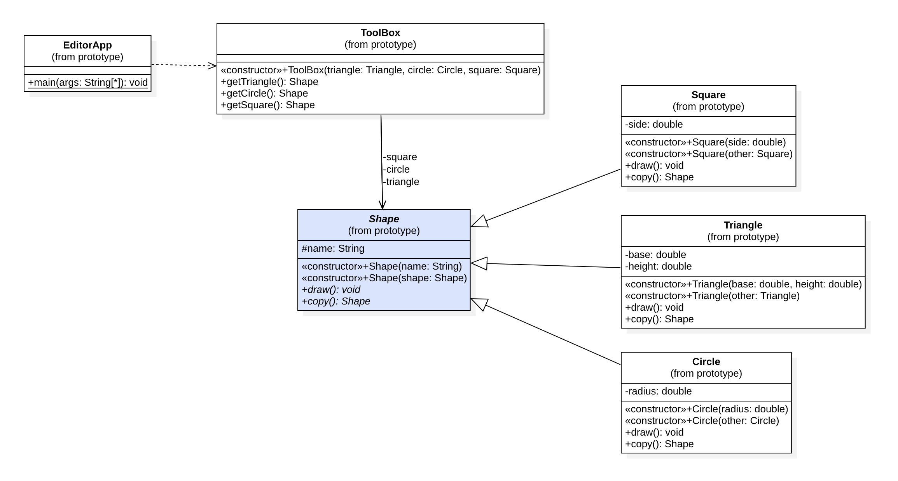

## Prototype Pattern

ရှိပြီးသား Object တစ်ခုကနေ နောက်ထပ် Object အသစ်တစ်ခုကို တည်ဆောက်လိုတဲ့ အခါမျိုးတွေမှာ Prototype Design Pattern ကို အသုံးပြုနိုင်ပါတယ်။ Object တစ်ခုကို တည်ဆောက်ဖို့အတွက် Resource တွေအများကြီးသုံးရမယ်၊ အချိန်တွေကြာနေနိုင်တယ် ဆိုရင် Object တစ်ခုကို ကြိုတင်တည်ဆောက်ထားပြီး အသုံးလိုတဲ့ အခါတိုင်းမှာ ကြိုဆောက်ထားတဲ့ Object ကို Copy ကူးပြီး နောက်ထပ် Object တစ်ခုကို တည်ဆောက်ပြီး အသုံးပြုသွားနိုင်မှာ ဖြစ်ပါတယ်။



အထက်ပါနမူနာကတော့ GuiApp တစ်ခုကို နမူနာယူပြီး ရေးသားထားတာ ဖြစ်ပါတယ်။ Application ထဲမှာ ToolBox တစ်ခုပါဝင်ပြီး Circle, Square, Triangle Shape တွေကို ပြသထားပါတယ်။ အဲ့ဒီ Shape တွေကို Click နှိပ်ပြီး သက်ဆိုရင်ရာ Shape ကို Create လုပ်ပြီး Editor ထဲမှာ Shape ကို နေရာချပေးတဲ့ အလုပ်ကို လုပ်နိုင်မှာ ဖြစ်ပါတယ်။

ဒီနေရာမှာ Shape တွေကို Create လုပ်ရတာကြာပြီး သုံးချင်တဲ့ Shape တွေဟာ ToolBox ထဲမှာကြိုရှိနေတယ်လို့ ဆိုကြပါစို့။ ဒီနေရာမှာ ရှိပြီးသား Shape ကို Copy ကူးသွားပြီး Object အသစ်တစ်ခုကို တည်ဆောက်ပေးလိုက်မယ် ဆိုတာကတော့ Prototype Pattern ရဲ့ Approach ပဲ ဖြစ်ပါတယ်။

### Implementations

- Prototype အနေနဲ့ Abstract Class Shape ကို အသုံးပြုပြီး Object တစ်ခုကိုတည်ဆောက်ဖို့အတွက် copy() ဆိုတဲ့ Method တစ်ခုကို ရေးသားထားဖို့လိုပါတယ်
- Copy ကူးဖို့ Method ကို Abstract Method အနေနဲ့ ရေးသားနိုင်ဖို့ Prototype ကို Abstract Class ဒါမှမဟုတ် Interface ကို အသုံးပြုရေးသားနိုင်ပါတယ်
- ဒီနေရာမှာတော့ Same Type ကို Argument ကို ရယူနေတဲ့ Constructor တစ်ခုကို Child Class တွေမှာ ရေးသားစေချင်တဲ့အတွက် Abstract Class ကို အသုံးပြုရေးသားထားတာ ဖြစ်ပါတယ်
- Concrete Prototype တွေအနေနဲ့ Circle, Triangle, Square တို့ကို ရေးသားထားပြီး copy() Method ကို Implement လုပ်ပြီးရေးသားထားပါတယ်

<small>Prototype Class</small>

```
public abstract class Shape {
	
	protected String name;
	
	// Constructor for new object
	public Shape(String name) {
		this.name = name;
	}
	
	// Constructor for copied object
	public Shape(Shape shape) {
		this.name = shape.name;
	}

	public abstract void draw();
	public abstract Shape copy();
}
```

<small>Concrete Prototype Class</small>

```
public class Circle extends Shape{
	
	private double radius;
	
	public Circle(double radius) {
		super("Circle");
		this.radius = radius;
	}

	public Circle(Circle other) {
		super(other);
		this.radius = other.radius;
	}

	@Override
	public void draw() {
		System.out.println("Drawing %s with radius %f.".formatted(name, radius));
	}

	@Override
	public Shape copy() {
		return new Circle(this);
	}

}
```

<small>Client Class</small>

```
public class ToolBox {

	private Shape triangle;
	private Shape circle;
	private Shape square;
	
	public ToolBox(Triangle triangle, Circle circle, Square square) {
		super();
		this.triangle = triangle;
		this.circle = circle;
		this.square = square;
	}
	
	public Shape getTriangle() {
		return triangle.copy();
	}
	
	public Shape getCircle() {
		return circle.copy();
	}
	
	public Shape getSquare() {
		return square.copy();
	}
	
}
```