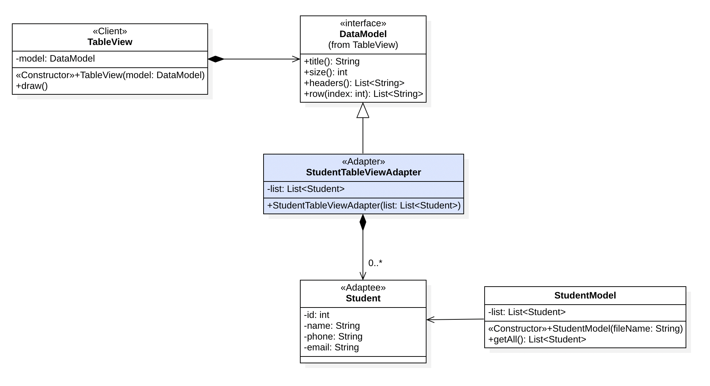

## Adapter Pattern

Adapter Pattern ကတော့ Structural Design Pattern တွေထဲက Pattern တစ်ခုဖြစ်ပါတယ်။ အပြင်လောကမှာလဲ ကျွန်တော်တို့က Adapter တွေကို အသုံးပြုနေကြတာမို့လို့ နားလည်ရလွယ်ကူမယ်နဲ့ တူပါတယ်။

ဆိုကြပါစို့။ ကျွန်တော်အသုံးပြုနေတဲ့ Computer ရဲ့ အားသွင်းကြိုးရဲ့ Plug ခေါင်းဟာ Three Pin ခေါင်းဖြစ်နေပြီး၊ ရှိနေတဲ့ Plug ပေါက်ဟာ Two Pin Plug ပေါက်ဖြစ်နေရင် ဘာလုပ်ကြမလဲ။ Three Pin to Three Pin Adapter လေးကို ကြားထဲမှာခံပြီး အသုံးပြုသွားကြမှာ ဖြစ်ပါတယ်။ 

Adapter Pattern ရဲ့ သဘောတရားကလဲ ဒီလိုပါပဲ။ ရေးသားထားတဲ့ Component တစ်ခုကို ကျွန်တော်တို့က အသုံးပြုချင်တယ်။ ဒါပေမဲ့ ကျွန်တောတို့မှာရှိတဲ့ Data တွေက Component က သုံးချင်တဲ့ ပုံစံရှိမနေဘူးဆိုရင်၊ ကြားထဲမှာ Adapter လေးတစ်ခုကို ရေးပြီး သုံးလို့ရအောင် လုပ်သွားရမှာ ဖြစ်ပါတယ်။



အထက်ပါနမူနာထဲမှာတော့ Console ပေါ်မှာ Table တွေကို ဖေါ်ပြဖို့အတွက် TableView Class တစ်ခုကို ရေးသားထားပါတယ်။ TableView ဟာ ဘယ်လို Data မျိုးကိုမဆို Table အနေနဲ့ ဖေါ်ပြဖို့လိုတဲ့အတွက် Implementation အပိုင်းကိုတော့ ရေးသားထားပြီး Data တွေကိုတော့ Abstraction ဖြစ်အောင် ရေးသားထားပါတယ်။ TableView ရဲ့ Data တွေကို ကိုယ်စားပြုတာကတော့ DataModel ဆိုတဲ့ Interface ဖြစ်ပါတယ်။ DataModel Interface ကို Implement လုပ်ထားတဲ့ Class တိုင်းကို TableView ရဲ့ Data အနေနဲ့ အသုံးပြုနိုင်မှာ ဖြစ်ပါတယ်။

တဖန် ကျွန်တော်တို့မှာရှိတာက File ထဲက Data တွေကို Read လုပ်ပြီး Student Object တွေအနေနဲ့ ရယူပေးနိုင်တဲ့ StudentModel Class ရှိပါတယ်။ StudentModel ရဲ့ getAll() Method ကနေ Student List ကို ရယူနိုင်ပါတယ်။ 

Student List ကို TableView နဲ့ တွဲပြီး အသုံးပြုချင်ပါတယ်။ ဒါပေမဲ့ TableView ကနေ Student List ကို တိုက်ရိုက် အသုံးပြုလို့မရပါဘူး။ ဒီနေရာမှာ StudentTableViewAdapter လေးကို ခံပြီး သုံးသွားမယ်ဆိုတာကတော့ Adapter Pattern ရဲ့ Approach ပဲ​ဖြစ်ပါတယ်။

### Implementation

- StudentTableViewAdapter ကို DataModel Interface ကို Implement လုပ်ပြီးရေးသားပါမယ်
- StudentTableViewAdapter ရဲ့ Member အနေနဲ့ Student List ကိုအသုံးပြုပါတယ်
- DataModel ကနေ Inheritance လုပ်လို့ရလာတဲ့ Method တွေကို Override လုပ်တဲ့ နေရာမှာ Student List ကို အသုံးပြုပြီး ရေးသားပေးပါမယ်

ဒီနည်းအားဖြင့် Student List ကို TableView ရဲ့ DataModel အနေနဲ့ အသုံးပြုသွားတာ ဖြစ်ပါတယ်။

<h5>Target Interface<h5>

```
	public static interface DataModel {
		String title();
		int size();
		List<String> headers();
		List<String> row(int index);
	}
```

<h5>Client Class<h5>

```
public class TableView {

	public static interface DataModel {
		String title();
		int size();
		List<String> headers();
		List<String> row(int index);
	}
	
	// Target as a member
	private DataModel model;
	
	private int rowLength;
	private List<Integer> colLengths;
	
	public TableView(DataModel model) {
		super();
		this.model = model;
		
		var headerLengths = model.headers().stream()
				.map(header -> header.length() + 4).toList();
		colLengths = new ArrayList<>(headerLengths);
		
		// Loop for each row
		for(var rowNum = 0; rowNum < model.size(); rowNum ++) {
			var rowData = model.row(rowNum);
			
			// Loop for each column of row
			for(var colNum = 0; colNum < rowData.size(); colNum ++) {
				
				var originalLength = colLengths.get(colNum);
				var colLength = rowData.get(colNum).length() + 4;
				
				if(originalLength < colLength) {
					colLengths.set(colNum, colLength);
				}
			}
		}
		
		rowLength = colLengths.stream().mapToInt(a -> a).sum();
	}

	public void draw() {
		printTitle();
		
		printHeader();
		
		printRows();
	}

	// Private Methods

}
```

<h5>Adapter Class<h5>

```
public class StudentTableViewAdapter implements DataModel{

	private List<Student> list;

	public StudentTableViewAdapter(List<Student> list) {
		super();
		this.list = list;
	}

	@Override
	public String title() {
		return "Student Table";
	}

	@Override
	public int size() {
		return list.size();
	}

	@Override
	public List<String> headers() {
		return List.of("ID", "NAME", "PHONE", "EMAIL");
	}

	@Override
	public List<String> row(int index) {
		var student = list.get(index);
		return List.of(
				String.valueOf(student.getId()), 
				student.getName(),
				student.getPhone(),
				student.getEmail());
	}
		
}
```

<h5>Using Adapter<h5>

```
public class AdapterDemo {

	public static void main(String[] args) {
		
		var model = new StudentModel("students.txt");
		
		// Adaptee
		var studentList = model.getAll();
		
		// Adapter
		var adapter = new StudentTableViewAdapter(studentList);
		
		// Client
		var tableView = new TableView(adapter);
		
		tableView.draw();
	}
}
```