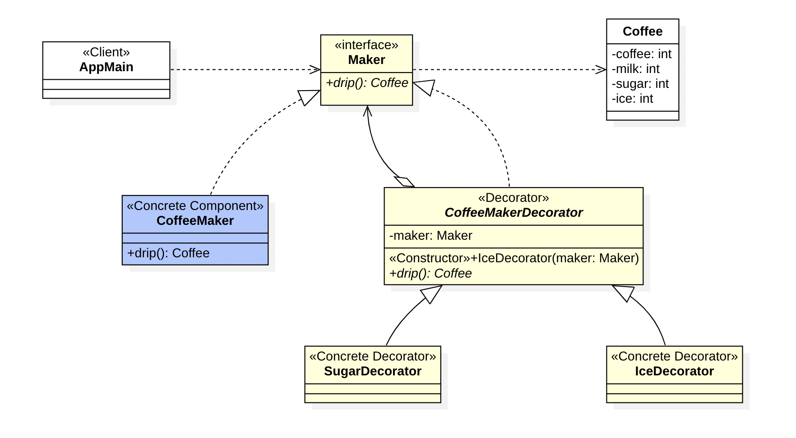

## Decorator Pattern

Decorator Pattern ဆိုတာက Structural Design Pattern အမျိုးအစား Design Pattern တစ်ခုဖြစ်ပြီး ရှိပြီးသား Component တစ်ခုရဲ့ Function တွေကို Modify လုပ်လိုတဲ့အခါမှာ အသုံးပြုနိုင်တဲ့ Pattern တစ်ခုဖြစ်ပါတယ်။

Decorator လေးတွေကို ကျွန်တော်တို့ အပြင်လောကမှာလဲ တွေ့မြင်နေကြဖြစ်ပါတယ်။ ကျွန်တော်တို့ Coffee ဆိုင်တစ်ဆိုင်သွားရင် ဆိုင်မှာ Black Coffee, Amaricano, Cafe latte, Cappuccino အစရှိသဖြင့် အမျိုးအစားတွေ အများကြီးရှိတာကို တွေ့ရပါမယ်။ ဒါပေမဲ့ အဲ့ဒီ Coffee တွေအားလုံးမှာ အခြေခံ Coffee ကရှိနေပြီး၊ Milk, Sugar, Ice အစရှိတာတွေကို Decorate လုပ်ပြီး မတူညီတဲ့ Coffee တွေကို Produce လုပ်နေကြတာပဲ ဖြစ်ပါတယ်။



### Implementations

ရှိပြီးသား Component တစ်ခုရဲ့ Function တွေကို Modify လုပ်လိုတဲ့အခါ၊ Function အသစ်တွေကို ထပ်မံဖြည့်စွက်လိုတဲ့ အခါမှာ Decorator Pattern ကို အသုံးပြုနိုင်ပါတယ်။ Decorator Pattern မှာ Component, Concrete Component, Decorator, Concrete Decorator တို့ ပါဝင်ကြပါတယ်။

#### Component

Abstraction ဖြစ်တဲ့ Interface ဒါမှမဟုတ် Abstract Class တစ်ခုခုကို အသုံးပြုရေးသားနိုင်ပါတယ်။ Conceptual Level Function တွေကို သတ်မှတ်ရေးသားထားနိုင်ပါတယ်။ နမူနာထဲမှာတော့ Maker Interface ကို Component အနေနဲ့ အသုံးပြုပြီး dript():Coffee Method တစ်ခုကို ရေးသားထားပါတယ်။

```
public interface Maker {

	Coffee drip();

}
```

#### Concrete Component

Component မှာပါတဲ့ Function တွေကို Implement လုပ်ပြီးရေးသားထားပြီး မူလ Function တွေကို လုပ်ဆောင်ပေးနိုင်တဲ့ Concrete Class တစ်ခုဖြစ်ပါတယ်။

```
public class CoffeeMaker implements Maker {

	@Override
	public Coffee drip() {
		var coffee = new Coffee();
		coffee.setCoffee(1);
		return coffee;
	}
}
```

#### Decorator

Component Interface ကို Implement လုပ်ထားတဲ့ Class တစ်ခုပါ။ ဒီနေရာမှာတော့ Abstract Class ကို အသုံးပြုပြီး Member အနေနဲ့ Component Object တစ်ခုကို ပိုင်ဆိုင်ပါတယ်။ Function တွေကို Implement လုပ်တဲ့ အခါမှာ Original Component တွေရဲ့ Function တွေကို Modify လုပ်သွားမှာ ဖြစ်ပါတယ်။ နမူနာထဲမှာတော့ Abstract Class ကို အသုံးပြုထားပြီး Function တွေကိုတော့ Decorator ရဲ့ Sub Class တွေကျမှ Modify လုပ်သွားမှာ ဖြစ်ပါတယ်။ 

Component ကို Constructor Argument ကနေ မဖြစ်မနေ ရယူစေချင်တဲ့ အတွက် ဒီနေရာမှာ Abstract Class ကို ရေးသားသွားတာ ဖြစ်ပါတယ်။

```
public abstract class CoffeeMakerDecorator implements Maker {

	protected Maker maker;

	public CoffeeMakerDecorator(Maker maker) {
		this.maker = maker;
	}

}
```

#### Concrete Decorators

Component ရဲ့ Function တွေကို Decorate လုပ်သွားမည့် Concrete Class တွေဖြစ်ကြပြီး Decorator Class ကို Extends လုပ်ထားရပါမယ်။ 

```
public class IceDecorator extends CoffeeMakerDecorator {

	public IceDecorator(Maker maker) {
		super(maker);
	}

	@Override
	public Coffee drip() {
		var coffee = maker.drip();
		coffee.setIce(1);
		return coffee;
	}
}
```

