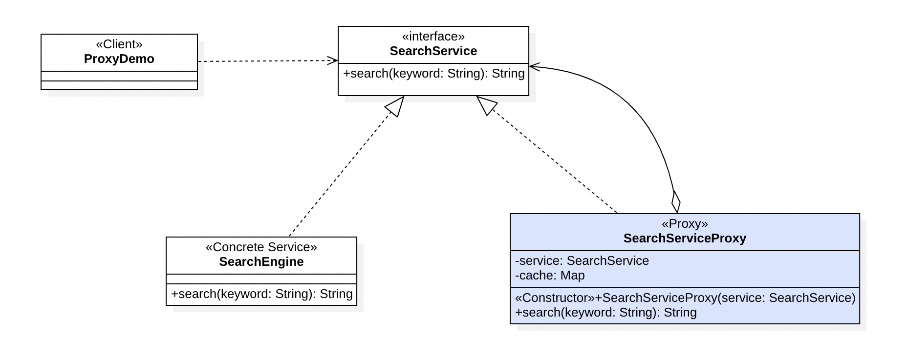

## Proxy Pattern

Proxy Pattern ဆိုတာကတော့ Structural Design Pattern အမျိုးအစားတစ်ခုဖြစ်ပြီး၊ Target Object တစ်ခုကို တိုက်ရိုက်ဆက်သွယ်ပြီး အလုပ်မလုပ်စေလိုတဲ့အခါမှာ ကိုယ်စား Object တစ်ခုကို ခံပြီး အသုံးပြုစေနိုင်တဲ့ Design Pattern ဖြစ်ပါတယ်။ Proxy ရဲ့ General Definition မှာကိုက "authority or power to act for another" လို့ဆိုတဲ့အတွက် ကိုယ်စားဆောင်ရွက်ပေးနိုင်တဲ့ သဘောသက်ရောက်ပါတယ်။

Proxy Pattern ကို Java Framework တွေအတော်များများမှာ တွေ့ရတတ်ပါတယ်။ 

- EJB ရဲ့ Remote Bean တွေနှင့် RMI Specification တွေမှာလဲ Proxy တွေကို အသုံးပြုထားကြပါတယ်
- JPA ရဲ့ Entity Object တွေဟာလဲ Proxy တွေဖြစ်ကြပြီး၊ Lazy Loaded Attribute တွေကို Setter Method ကနေ Access လုပ်တဲ့အခါမှာ Database ကနေ Fatch လုပ်နိုင်အောင် ဆောင်ရွက်ပေးကြပါတယ်
- Spring AOP မှာလဲ Cross Cutting ကို ဆောင်ရွက်နိုင်အောင် Proxy တွေကို အသုံးပြုကြပါတယ်
- Object တွေရဲ့ Access Control ကို ဆောင်ရွက်လိုတဲ့ အခါတွေမှာလဲ Proxy တွေကို အသုံးပြုကြပါတယ်

### Implementation

နမူနာအနေနဲ့ Search Engine တစ်ခုရှိပြီး၊ အဲ့ဒီ Search Engine မှာ Data တွေကို ရှာရတာ Resource တွေကို အရမ်းသုံးရပြီး အချိန်ကြာနိုင်တယ်လို့ ဆိုကြပါစို့။ အဲ့ဒီအခါမျိုးမှာ ကျွန်တော်တို့အနေနဲ့ တစ်ခါရှာထားပြီးသားစကားလုံးကို Cache ထဲမှာ သိမ်းထားပြီး Cache ထဲမှာမရှိမှသာ Search Engine ကို အသုံးပြုပြီးရှာမယ်လို့ လုပ်ချင်ပါလိမ့်မယ်။ အဲ့ဒီလိုအခါမျိုးတွေမှာ Proxy Pattern ကို အသုံးပြုနိုင်ပါတယ်။



#### Service Interface

```
public interface SearchService {

	String search(String keyword);
}
```

#### Concrete Service Class

```
public class SearchEngine implements SearchService{
	
	private Map<String, String> engine;
	
	public SearchEngine() {
		engine = new HashMap<>();
		engine.put("Hi", "Hello");
		engine.put("japanese hi", "konni chiwa");
		engine.put("sayonara", "Good Bye");
		engine.put("thanks", "Arigato");
		engine.put("java", "Programming Language");	
	}

	@Override
	public String search(String keyword) {
		
		try {
			Thread.sleep(2000);
		} catch (InterruptedException e) {
			e.printStackTrace();
		}
		
		var result = engine.get(keyword);
		
		if(null == result) {
			result = "There is no result";
		}
		
		return result;
	}

}
```

Service Interface ကို Implement လုပ်ထားတဲ့ Business Class ဖြစ်ပြီး၊ Search Operation ကို လုပ်ဆောင်ရာမှာ အချိန်ကြာတယ် ဆိုတာကို ဖြစ်အောင် နမူနာ အနေနဲ့ ရေးသားထားပါတယ်။

#### Proxy Class

```
public class SearchServicePorxy implements SearchService{

	private Map<String, String> cache;
	private SearchService serivce;
	
	public SearchServicePorxy(SearchService serivce) {
		super();
		this.serivce = serivce;
		cache = Collections.synchronizedMap(new HashMap<>());
	}

	@Override
	public String search(String keyword) {
		
		var result = cache.get(keyword);
		
		if(result == null) {
			result = serivce.search(keyword);
			
			if(!result.equals("There is no result")) {
				cache.put(keyword, result);
			}
		}
		
		return result;
	}

}
```

Cache ကို အသုံးပြုနိုင်တဲ့ Proxy အနေနဲ့ကတော့ Service Interface ကို Implement လုပ်ထားပြီး၊ Concrete Service ကို Member Object အနေနဲ့ အသုံးပြုထားပါတယ်။ 

Search Method ကို လုပ်ဆောင်တိုင်းမှာ အရင်ဆုံး Cache ထဲကနေ Keyword နဲ့ရှာပြီး၊ မတွေ့ရင် Service Object ကို အသုံးပြုပြီးရှာပါတယ်။ Service ကို သုံးပြီးရှာတဲ့အခါ တွေ့လာရင်လဲ Cache ထဲမှာ မှတ်သွားပါတယ်။ ဤနည်းအားဖြင့် Search Method ရဲ့ Operation ကို မြန်ဆန်စွာ ဆောင်ရွက်နိုင်အောင် Proxy လေးက လုပ်ဆောင်ပေးနိုင်ပါတယ်။

Proxy Pattern ရဲ့ အဓိက ရည်ရွယ်ချက်ကတော့ နဂိုရှိရင်းစွဲ Operation တွေမှာ Logic အသစ်တွေကို ဖြည့်စွက်လိုတဲ့အခါ Modify လုပ်ပြီး အသုံးပြုလိုတဲ့ အခါမှာ နဂိုရှိရင်းစွဲ Operation ကို တိုက်ရိုက်မပြင်ပဲ Extends လုပ်ပြီးရေးသွားနိုင်ဖို့အတွက်ပဲ ဖြစ်ပါတယ်။