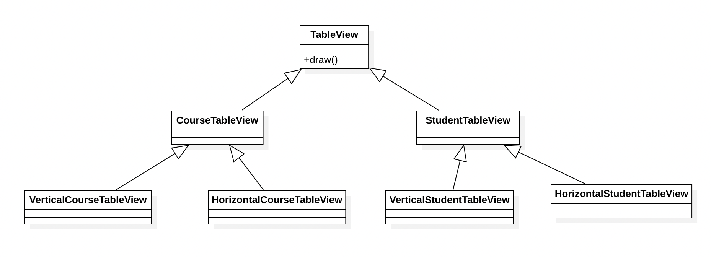
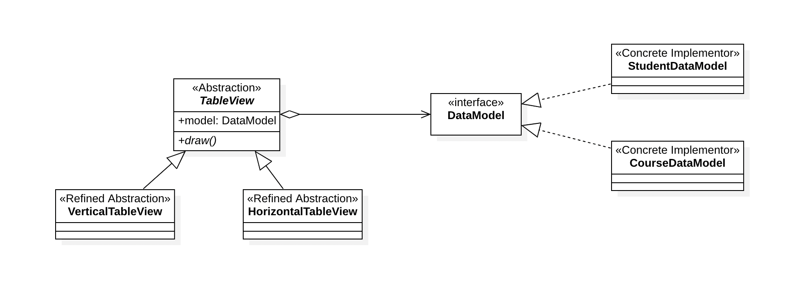

## Bridge Pattern

တကယ်လို့ Object တစ်ခုမှာ Abstraction အပိုင်းနှင့် Implementation အပိုင်းတို့မှာ သီးခြားစီတည်ရှိနေပြီး၊ အသီးသီးပြောင်းလဲနိုင်ခြေရှိတယ်ဆိုရင် Bridge Pattern ကို အသုံးပြုနိုင်ပါတယ်။ 

ရေးသားနေတဲ့ System တစ်ခုမှာ TableView တစ်ခုကို ရေးဖို့လိုအပ်လာပြီး၊ အဲ့ဒီ TableView နဲ့ Student Data တွေနဲ့ Course Data တွေကို ပြဖို့လိုအပ်တယ်လို့ ဆိုကြပါစို့။ ထို့အပြင် Table ကိုလဲ Vertical Table View အနေနဲ့ကော Horizontal Table View အနေနဲ့ပါရေးဖို့လိုအပ်တဲ့ အခါမျိုးမှာ Class Design တွေကိုအောက်ပါအတိုင်း စဉ်းစားမိကြပါလိမ့်မယ်။



ဒီနေရာမှာ Table ကို ဘယ်လို Data တွေနဲ့ သုံးမှာလဲဆိုတဲ့ Implementation အပိုင်းနဲ့ ဘယ်လို Presentation မျိုးနဲ့ပြမလဲ ဆိုတဲ့ Abstraction အပိုင်းတွေရှိကြပြီး နှစ်မျိုးစလုံးမှာ ပြောင်းလဲမှုတွေရှိလာနိုင်တဲ့ အချက်က ပြဿနာပဲ ဖြစ်ပါတယ်။ ဘယ်နေရာမှာပဲ ပြောင်းပြောင်း ပြင်ရမည့်နေရာတွေက တစ်နေရာထဲမှာ ပြီးမသွားဘူးဆိုတဲ့ အချက်ပါပဲ။

Registration Data ကိုလဲ Table View မှာ သုံးချင်လာတယ် ဆိုကြပါစို့။ အနဲဆုံး VerticalRegistrationTableView နဲ့  HorizontalRegistrationTableView ဆိုတဲ့ Class နှစ်ခုကို ထပ်ပြီးဖြည့်စွက်ကြရပါတော့မယ်။



အထက်ပါ Class Diagram အတိုင်း ဘယ်လို Data နဲ့ပြမလဲ ဆိုတဲ့အပိုင်းနှင့် Table View ကို ဘယ်လိုပြမလဲဆိုတဲ့ အပိုင်းကို အသီးသီးခွဲထုတ်ပြီး၊ Polymorphic ဖြစ်အောင် ရေးသားစေခြင်းအားဖြင့် ဘယ်ဘက်ကပဲ ပြောင်းပြောင်း တစ်ခြားတစ်ဘက်ကို ပြင်စရာမလိုအောင် ဆောင်ရွက်စေနိုင်တယ်ဆိုတာကတော့ Bridge Pattern ရဲ့ ရည်ရွယ်ချက်ဖြစ်ပါတယ်။

###​ Implementations

Bridge Pattern မှာ Abstraction, Refined Abstraction, Implementor, Concrete Implementor ဆိုတဲ့ Class တွေနဲ့ ဖွဲ့စည်းတည်ဆောက်ထားပါတယ်။

#### Abstraction

Component ရဲ့ အဓိကလုပ်ဆောင်စေလိုတဲ့ Behavior ကို သတ်မှတ်ထားပြီး၊ ဘယ်လို Implementation မျိုးနဲ့တွဲဖက်အသုံးပြုမှာလဲ ဆိုတာကို သတ်မှတ်ဖို့အတွက် Implementor ကို Reference လုပ်ထားနိုင်ဖို့လိုအပ်ပါတယ်။ ဖေါ်ပြပါနမူနာထဲမှာတော့ TableView Class ဟာ Abstraction နေရာကို ကိုယ်စားပြုတဲ့ Class ဖြစ်ပါတယ်။ Table View ဖြစ်သည့်အလျောက် Table တစ်ခုကို ဘယ်လိုတည်ဆောက်မလဲဆိုတဲ့ draw() Method ဟာ Component ရဲ့ Interface ဖြစ်ပါတယ်။

တဖန် ဘယ်လို Data မျိုးနဲ့ Table View ကို တည်ဆောက်ရမလဲဆိုတာကို ပံ့ပိုးပေးနိုင်တဲ့ Implementor ဖြစ်တဲ့ DataModel ကို Reference လုပ်ထားပါတယ်။ လက်တွေ့ Table View ကို တည်ဆောက်တဲ့အခါမှာလဲ DataModel ကို အသုံးပြုပြီး တည်ဆောက်သွားပါတယ်။ 

```
public abstract class TableView {

	// Reference to Implementor
	protected DataModel model;
	
	protected List<Integer> colLengths;
	
	// Inject Implementor from Constructor Argument
	public TableView(DataModel model) {
		super();
		this.model = model;
		colLengths = new ArrayList<>();
		
		init();
	}
	
	protected abstract void init();
	
	// Main Function (Abstraction Interface)
	public abstract void draw();
	
	// Common Methods
	
}
```

#### Refined Abstraction

Abstraction ဖြစ်တဲ့ TableView Class ရဲ့ draw() Method ကို Presentation အလိုက် Extends လုပ်ပြီး သတ်မှတ်ရေးသားပေးဖို့ တာဝန်ရှိပါတယ်။ နမူနာထဲမှာတော့ HorizontalTableView နှင့် VerticalTableView တို့ဟာ Refined Abstraction တွေဖြစ်ကြပါတယ်။ 

```
public class HorizontalTableView extends TableView{

	public HorizontalTableView(DataModel model) {
		super(model);
	}

	@Override
	protected void init() {
		
		colLengths.addAll(model.headers().stream().map(a -> a.length() + 4).toList());
		
		for(var rowIndex = 0; rowIndex < model.size(); rowIndex ++) {
			
			var row = model.row(rowIndex);
			
			for(var colIndex = 0; colIndex < row.size(); colIndex ++) {
				
				var colSize = row.get(colIndex).length() + 4;
				
				if(colSize > colLengths.get(colIndex)) {
					colLengths.set(colIndex, colSize);
				}
			}
		}
	}

	// Extension point of Abstraction
	@Override
	public void draw() {
		
		// Draw Title
		System.out.println("Horizontal %s Table".formatted(model.title()));
		printLine();
		printRow(model.headers());
		printLine();
		
		for(var i = 0; i < model.size(); i ++) {
			printRow(model.row(i));
		}
		printLine();		
	}
	
	// Private Methods

}
```

#### Implementor

Abstraction ထဲမှာ အသုံးပြုလိုတဲ့ လုပ်ဆောင်ချက်တွေကို စုစည်းပေးထားတဲ့ Interface တစ်ခုဖြစ်ပါတယ်။ Abstraction ထဲမှာ အဓိကလုပ်ဆောင်လိုတဲ့ အလုပ်ကို Implementor ဘက်ကနေပြင်ပေးထားတဲ့ Behavior တွေကို အသုံးပြုပြီး ရေးသားသွားကြရမှာ ဖြစ်ပါတယ်။ နမူနာထဲမှာတော့ DataModel Interface ဟာ Implementor နေရာကို ကိုယ်စားပြုပါတယ်။

```
public interface DataModel {

	String title();
	
	int size();
	
	List<String> headers();
	
	List<String> row(int index);
}
```

#### Concrete Implementor

Implementor Interface ကို Implements လုပ်ထားတဲ့ Concrete Class တွေဖြစ်ကြပြီး၊ Abstraction မှာ အသုံးပြုမည့် Primitive Operation တွေကို အသေးစိတ် ရေးသားပေးထားရပါမယ်။ နမူနာထဲက StudentDataModel နှင့် CourseDataModel တို့ဟာ Concrete Implementor များဖြစ်ကြပါတယ်။

```
public class CourseDataModel implements DataModel{
	
	private List<Course> courses;
	
	public CourseDataModel(String fileName) {
		try(var stream = Files.lines(Path.of(fileName))) {
			courses = stream.map(Course::from).toList();
		} catch (IOException e) {
			e.printStackTrace();
		}
	}

	@Override
	public String title() {
		return "Course";
	}

	@Override
	public int size() {
		return courses.size();
	}

	@Override
	public List<String> headers() {
		return List.of("ID", "NAME", "LEVEL", "HOURS", "FEES");
	}

	@Override
	public List<String> row(int index) {
		return courses.get(index).toList();
	}

}
```
