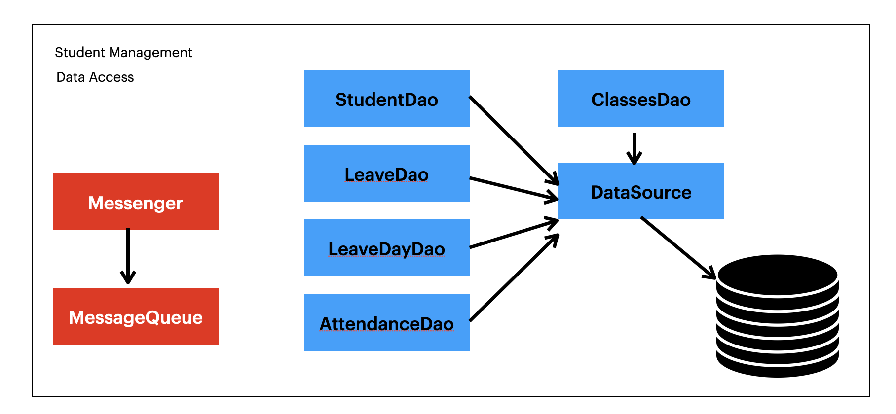
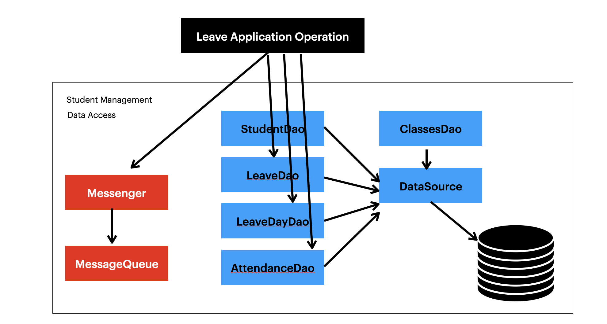
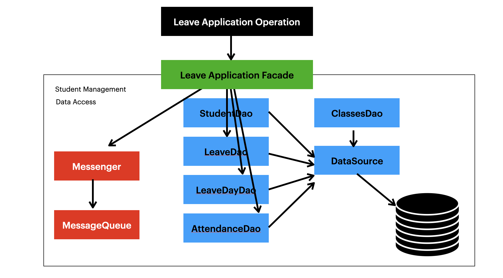

## Facade Pattern

Facade Pattern ဟာ Structural Design Pattern အမျိုးအစားထဲက Design Pattern တစ်ခုဖြစ်ပြီး၊ ရေးသားနေတဲ့ Library, Framework, Sub System တစ်ခုအတွက် ရိုးရှင်းတဲ့ Interface တစ်ခုကို ပြင်ဆင်ပေးနိုင်ပါတယ်။ 

Class များစွာပါဝင်တဲ့ Sub System တစ်ခုကို ရေးသားနေကြပြီး အတွင်းပိုင်းမှာ Class တွေရဲ့ Dependency ကလဲ ရှုပ်ထွေးနေတယ်ဆိုရင် အသုံးပြုသူတစ်ယောက်အနေနဲ့ Class တစ်ခုကို အသုံးပြုဖို့ ဘယ်လို Dependency တွေကို ပြင်ဆင်ပေးရမယ်ဆိုတာဟာ အမတန် စိတ်ရှုပ်စရာကောင်းလာမှာ ဖြစ်ပါတယ်။

Student Management System ရဲ့ Backend အတွက် Sub System တစ်ခုကို စဉ်းစားကြည့်မယ်ဆိုရင်ပဲ Database Table တွေကို ကိုယ်စားပြုတဲ့ DTO Class တွေ၊ Data Access Object အတွက် DAO Class တွေပြီးတော့ Message Queue တွေနဲ့ Daemon Service Class တွေများစွာပါဝင်နိုင်ပါတယ်။ Sub System အတွင်မှာရှိတဲ့ Class တွေဟာလဲ ဘယ် Class က ဘယ် Class ကို သုံးနေတယ်ဆိုတာက Code တွေကို ဖွင့်မကြည့်ပဲ မသိနိုင်ပါဘူး။ 

နမူနာအနေနဲ့ Leave ကို Apply လုပ်တဲ့ Operation တစ်ခုကို စဉ်းစားကြည့်ကြရအောင်။ 

- Leave Application Table ထဲကို Record တစ်ကြောင်း Insert လုပ်ရပါမယ်
- Leave Days Table ထဲကို သက်ဆိုင်ရာ ရက်အလိုက် Record တွေကို Insert လုပ်ရပါမယ်
- Attendance Table ထဲကို Leave Status နဲ့ သက်ဆိုင်ရာ ရက်အလိုက် Record တွေကို Insert လုပ်ရပါမယ်
- Message Queue ထဲကို Leave Application Operation ပြီးဆုံးကြောင်း Message တစ်ခုကို ဖြည့်စွက်ထားရပါမယ်

အထက်ပါ Operation တွေကို အစီအစဉ်အလိုက် မှန်ကန်အောင် ရေးသားပေးရမှာ ဖြစ်ပါတယ်

Client Operation အတွက် Dependency Object တွေကော Operation Step တွေပါ ရှုပ်ထွေးလာကြမှာ ဖြစ်ပါတယ်။ Sub System အတွက် ရိုးရှင်းတဲ့ Interface တွေကို ပြင်ဆင်ထားပြီး အတွင်းပိုင်းဖွဲစည်းတည်ဆောက်ပုံကို Client ဆီကနေ Hide လုပ်ထားမယ်။ ဤနည်းအားဖြင့် Sub System ရဲ့ Function တွေကို လွယ်ကူစွာဆောင်ရွက်နိုင်အောင်ပြင်ဆင်ပေးမယ် ဆိုတာကတော့ Facade Pattern ရဲ့ Approach ပဲ ဖြစ်ပါတယ်။

Public Method တွေဟာ Object တစ်ခုရဲ့ အသုံးပြုနိုင်တဲ့ Interface တွေဖြစ်ကြမယ်ဆိုရင်၊ Facade တွေဟာ Sub System တစ်ခုရဲ့ အသုံးပြုနိုင်တဲ့ Interface တွေပဲဖြစ်ကြပါတယ်။ Facade Pattern ကို အသုံးပြုခြင်းအားဖြင့် အောက်ပါ အကျိုးတွေကို ရရှိနိုင်ပါတယ်။ 

1. Facade တွေဟာ Sub System Classes တွေကို Client တွေကနေ မတွေ့ရအောင် Hide လုပ်ပေးထားနိုင်တဲ့အတွက် အသုံးပြုသူဘက်ကကြည့်မယ်ဆိုရင် သုံးရတာလွယ်ကူစေပါတယ်။ 
2. Client နှင့် Sub System Classes တွေအကြားမှာရှိတဲ့ Coupling ကို လျော့ချပေးနိုင်တဲ့အတွက်၊ Client ဘက်မှာကော Sub System ဘက်မှာပါ ပြင်စရာရှိလို့ ပြင်ကြမယ်ဆိုရင်တောင် အပြန်အလှန် အကျိုးသက်ရောက်မှုကိုမရှိအောင် ဆောင်ရွက်ပေးနိုင်ပါတယ်။
3. Facade Pattern ဟာ Sub System Classes တွေကို Client ကနေ မသုံးရဘူးလို့ တားမြစ်ထားတာတော့ မဟုတ်ပါဘူး။ လိုအပ်ပါက အသုံးပြုနိုင်ပါတယ်။ Client Developer တွေအနေနဲ့ ရွေးချယ်ရမှာကတော့ Easy to Use (သုံးရတာလွယ်ကူတဲ့ ပုံစံ)​လား၊ Generics ကျတဲ့ပုံစံနဲ့ သုံးချင်တာလားဆိုတဲ့ အချက်ပဲ ဖြစ်ပါမယ်။

### Implementation

